# Investigación sobre De-identificación de Datos

## Contenido

- [Investigación sobre De-identificación de Datos](#investigación-sobre-de-identificación-de-datos)
  - [Contenido](#contenido)
  - [Introducción](#introducción)
    - [Ejemplo Práctico de De-identificación](#ejemplo-práctico-de-de-identificación)
  - [Métodos y Técnicas](#métodos-y-técnicas)
    - [Técnicas Básicas de De-identificación](#técnicas-básicas-de-de-identificación)
    - [Técnicas Avanzadas](#técnicas-avanzadas)
    - [Enfoque por Tipo de Dato](#enfoque-por-tipo-de-dato)
    - [Comparativa de Métodos](#comparativa-de-métodos)
  - [Evaluación de Riesgos](#evaluación-de-riesgos)
    - [Vectores de Re-identificación](#vectores-de-re-identificación)
      - [Ataques de Vinculación](#ataques-de-vinculación)
      - [Análisis de Singularidad](#análisis-de-singularidad)
      - [Inferencia a través de Modelos](#inferencia-a-través-de-modelos)
      - [Ataque a Infraestructura](#ataque-a-infraestructura)
    - [Metodologías de Evaluación de Riesgos](#metodologías-de-evaluación-de-riesgos)
      - [Análisis k-anonimato, l-diversidad y t-proximidad](#análisis-k-anonimato-l-diversidad-y-t-proximidad)
      - [Test de Penetración y Ejercicios de Re-identificación](#test-de-penetración-y-ejercicios-de-re-identificación)
      - [Evaluación de Riesgos para LLMs](#evaluación-de-riesgos-para-llms)
    - [Cuantificación del Riesgo](#cuantificación-del-riesgo)
      - [Modelos Probabilísticos](#modelos-probabilísticos)
      - [Matrices de Riesgo](#matrices-de-riesgo)
    - [Estrategias de Mitigación](#estrategias-de-mitigación)
      - [Enfoque por Capas](#enfoque-por-capas)
      - [Mitigaciones Específicas para LLMs](#mitigaciones-específicas-para-llms)
    - [Equilibrio entre Utilidad y Privacidad](#equilibrio-entre-utilidad-y-privacidad)
    - [Monitoreo Continuo y Re-evaluación](#monitoreo-continuo-y-re-evaluación)
  - [Arquitectura Privacy Data Vault](#arquitectura-privacy-data-vault)
    - [Componentes principales de una arquitectura PDV:](#componentes-principales-de-una-arquitectura-pdv)
    - [Diagrama de la Arquitectura PDV:](#diagrama-de-la-arquitectura-pdv)
    - [Consideraciones de Ciberseguridad para PDV:](#consideraciones-de-ciberseguridad-para-pdv)
    - [Implementación Técnica Segura:](#implementación-técnica-segura)
  - [Aplicación de LLMs](#aplicación-de-llms)
    - [Desafíos específicos de LLMs:](#desafíos-específicos-de-llms)
    - [Enfoques para de-identificación en contextos de LLMs:](#enfoques-para-de-identificación-en-contextos-de-llms)
    - [Diagrama de Integración LLMs con PDV:](#diagrama-de-integración-llms-con-pdv)
    - [Técnicas Avanzadas para LLMs Seguros:](#técnicas-avanzadas-para-llms-seguros)
    - [Evaluación y Mitigación de Riesgos en LLMs:](#evaluación-y-mitigación-de-riesgos-en-llms)
  - [Marco Normativo](#marco-normativo)
    - [Principales Regulaciones por Región](#principales-regulaciones-por-región)
      - [Europa](#europa)
      - [Norteamérica](#norteamérica)
      - [Asia-Pacífico](#asia-pacífico)
      - [Latinoamérica](#latinoamérica)
    - [Normativas Sectoriales](#normativas-sectoriales)
      - [Sector Sanitario](#sector-sanitario)
      - [Sector Financiero](#sector-financiero)
      - [Investigación y Estadística](#investigación-y-estadística)
    - [Estándares Técnicos y Mejores Prácticas](#estándares-técnicos-y-mejores-prácticas)
    - [Implicaciones para Sistemas con LLMs](#implicaciones-para-sistemas-con-llms)
    - [Implementación de Cumplimiento en Arquitecturas PDV](#implementación-de-cumplimiento-en-arquitecturas-pdv)
    - [Consideraciones para Cumplimiento Multinacional](#consideraciones-para-cumplimiento-multinacional)
    - [Evolución del Marco Regulatorio](#evolución-del-marco-regulatorio)
  - [Casos de Uso](#casos-de-uso)
  - [Casos de Uso](#casos-de-uso-1)
    - [Sector Sanitario: Investigación Clínica Multicéntrica](#sector-sanitario-investigación-clínica-multicéntrica)
    - [Sector Financiero: Sistema de Prevención de Fraude Interbancario](#sector-financiero-sistema-de-prevención-de-fraude-interbancario)
    - [Sector Público: Análisis de Movilidad Urbana y Planificación](#sector-público-análisis-de-movilidad-urbana-y-planificación)
    - [Aplicaciones de IA Generativa: Asistente Clínico Automatizado](#aplicaciones-de-ia-generativa-asistente-clínico-automatizado)
    - [Sector RRHH: Sistema Inteligente de Selección de Personal](#sector-rrhh-sistema-inteligente-de-selección-de-personal)
    - [Lecciones Aprendidas y Mejores Prácticas Transversales](#lecciones-aprendidas-y-mejores-prácticas-transversales)
  - [Conclusiones y Recomendaciones](#conclusiones-y-recomendaciones)
    - [Conclusiones Principales](#conclusiones-principales)
    - [Recomendaciones Estratégicas](#recomendaciones-estratégicas)
    - [Consideraciones para Implementación Práctica](#consideraciones-para-implementación-práctica)
    - [Visión de Futuro](#visión-de-futuro)
  - [Glosario de Términos](#glosario-de-términos)

## Introducción

La de-identificación es un proceso fundamental en la protección de la privacidad que consiste en eliminar o modificar información personal identificable (PII) de conjuntos de datos, de manera que no sea posible asociar dichos datos con individuos específicos. En el contexto de seguridad, la de-identificación actúa como una capa protectora que permite el uso y análisis de información valiosa mientras se salvaguarda la privacidad de las personas.

A diferencia de la anonimización (que busca eliminar permanentemente cualquier posibilidad de re-identificación), la de-identificación suele mantener mecanismos para que entidades autorizadas puedan revertir el proceso cuando sea legítimamente necesario, lo que la convierte en una técnica más flexible y aplicable en diversos escenarios.

Los objetivos principales de la de-identificación incluyen:

1. **Protección de privacidad**: Prevenir la exposición no autorizada de información personal.
2. **Cumplimiento normativo**: Satisfacer requisitos legales como GDPR, HIPAA, CCPA, entre otros.
3. **Facilitación de análisis de datos**: Permitir el procesamiento y análisis sin comprometer la privacidad.
4. **Minimización de riesgos**: Reducir las consecuencias de posibles brechas de seguridad.

### Ejemplo Práctico de De-identificación

Para ilustrar cómo funciona la de-identificación en un entorno real, consideremos el siguiente escenario:

Supongamos que una empresa necesita redactar una carta de oferta de empleo para un candidato. Esta carta contiene información personal identificable como nombre completo, ubicación y posición laboral. Al implementar un sistema de de-identificación en un entorno empresarial o nube privada, la información sensible pasa por un proceso de tokenización antes de ser procesada por modelos de IA, y posteriormente es re-identificada para producir el documento final.

Como se observa en la imagen, el proceso tiene las siguientes fases:

1. **Petición original** con datos sensibles (PII): "Draft me an offer letter for Nelson Rodriguez from Bogotá, Colombia, for the position of Senior Software Engineer"
2. **Fase de de-identificación**: Los identificadores personales son reemplazados por tokens o marcadores genéricos
3. **Procesamiento seguro**: La solicitud anonimizada "Draft me an offer letter for [NAME_1] from [LOCATION_1], for the position of [OCCUPATION_1]" es procesada por modelos de IA (como OpenAI, Anthropic, Cohere, Bard, Meta)
4. **Re-identificación**: El resultado genérico "Dear [NAME_1], We are pleased to offer you employment at [Your Company Name] for the [OCCUPATION_1] position in our [LOCATION_1] Office..." se vuelve a contextualizar con la información original
5. **Respuesta final** con los datos personales reincorporados: "Dear Nelson, We are pleased to offer you employment at [Your Company Name] for the Senior Software Engineer position in our Bogotá, Colombia Office..."

Este ejemplo demuestra cómo la de-identificación permite aprovechar tecnologías avanzadas como los LLMs para procesar información sin exponer datos sensibles a los sistemas externos, manteniendo la privacidad y cumpliendo con las normativas de protección de datos.

## Métodos y Técnicas

La de-identificación comprende un amplio espectro de métodos y técnicas que varían en complejidad, reversibilidad y nivel de protección ofrecido. Esta sección explora las principales aproximaciones, organizadas según su sofisticación y ámbito de aplicación.

### Técnicas Básicas de De-identificación

Las técnicas fundamentales constituyen la base de cualquier estrategia de de-identificación y se utilizan ampliamente en diferentes contextos:

1. **Supresión**: Eliminación completa de elementos de datos sensibles.
   - **Supresión de columnas**: Eliminación de campos completos (ej. números de seguridad social)
   - **Supresión de registros**: Eliminación de filas enteras que contienen datos muy sensibles
   - **Supresión selectiva**: Reemplazo de partes específicas de datos con caracteres especiales (ej. convertir "123-45-6789" en "XXX-XX-6789")

2. **Generalización**: Reducción de la precisión de los datos manteniendo su utilidad general.
   - **Agrupación**: Sustitución de valores precisos por rangos (ej. edad exacta por grupos de edad)
   - **Enmascaramiento**: Sustitución de caracteres manteniendo el formato (ej. últimos dígitos de tarjetas)
   - **Truncamiento**: Reducción de precisión eliminando detalles (ej. código postal completo a solo primeros dígitos)

3. **Perturbación**: Modificación de valores originales mediante técnicas aleatorias o deterministas.
   - **Adición de ruido**: Introducción de variaciones aleatorias en valores numéricos
   - **Permutación**: Intercambio de valores entre diferentes registros
   - **Micro-agregación**: Reemplazo de grupos de registros por valores promedio del grupo

### Técnicas Avanzadas

Existen técnicas más sofisticadas que ofrecen mayor protección y flexibilidad:

1. **Tokenización**: Sustitución de datos sensibles por identificadores no sensibles (tokens).
   - **Tokenización basada en formato (FPE)**: Generación de tokens que mantienen el formato del dato original
   - **Tokenización reversible**: Permite recuperar los datos originales mediante un proceso controlado
   - **Tokenización no reversible**: No permite recuperación directa, similar a un hash criptográfico

2. **Métodos Criptográficos**:
   - **Cifrado homomórfico**: Permite operaciones sobre datos cifrados sin necesidad de descifrarlos
   - **Hashing con sal**: Aplicación de funciones hash con valores aleatorios adicionales para prevenir ataques de diccionario
   - **Cifrado determinista**: Produce siempre el mismo resultado cifrado para el mismo valor de entrada, permitiendo búsquedas

3. **Técnicas basadas en modelos**:
   - **Computación de privacidad diferencial**: Añade ruido calibrado a los datos o consultas para garantizar la privacidad
   - **Sintéticos**: Generación de datos sintéticos estadísticamente similares a los originales pero sin correspondencia directa
   - **Federación**: Procesamiento de datos en dispositivos locales enviando solo resultados agregados

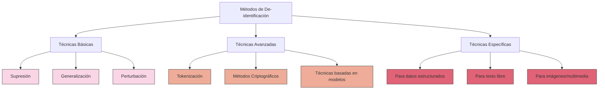

### Enfoque por Tipo de Dato

La elección de técnicas también debe considerar la naturaleza de los datos a procesar:

1. **Datos Estructurados** (bases de datos tradicionales):
   - Aplicación de reglas específicas por campo según su sensibilidad
   - Uso de claves de sustitución y normalización de datos
   - Creación de tablas asociativas protegidas para la re-identificación autorizada

2. **Datos No Estructurados** (texto libre):
   - **Reconocimiento de Entidades Nombradas (NER)**: Detección automática de PII en texto
   - **Etiquetado semántico**: Identificación de información sensible según contexto
   - **Reescritura asistida por LLMs**: Uso de modelos de lenguaje para reescribir texto manteniendo el significado pero eliminando PII

3. **Datos Multimedia** (imágenes, audio, video):
   - Detección y difuminado facial en imágenes
   - Modificación de voz en grabaciones
   - Técnicas de marca de agua para mantener control sobre datos sensibles

La de-identificación de texto presenta desafíos únicos que requieren aproximaciones específicas:

- **Ofuscación contextual**: Modificación de detalles específicos manteniendo la coherencia narrativa
- **Abstracción de conceptos**: Reemplazo de información específica por categorizaciones más generales
- **Detección de PII implícito**: Identificación de información que, aunque no directamente identificable, podría serlo en conjunto

### Comparativa de Métodos

Al evaluar qué técnicas implementar en un escenario específico, es fundamental considerar el balance entre tres dimensiones clave:

| Técnica | Nivel de Protección | Utilidad de Datos | Complejidad de Implementación | Reversibilidad |
|---------|---------------------|-------------------|-------------------------------|---------------|
| Supresión | Alto | Bajo | Baja | No |
| Generalización | Medio | Medio | Baja | No |
| Perturbación | Medio-Alto | Medio | Media | Limitada |
| Tokenización | Alto | Alto | Alta | Sí (controlada) |
| Métodos Criptográficos | Muy Alto | Medio-Alto | Muy Alta | Sí (con claves) |
| Privacidad Diferencial | Muy Alto | Medio | Alta | No |
| Datos Sintéticos | Muy Alto | Medio-Alto | Alta | No |

Las técnicas más efectivas son aquellas que permiten una reversibilidad controlada mientras mantienen un alto nivel de protección. La tokenización emerge como un balance óptimo, especialmente cuando se implementa dentro de una arquitectura PDV como la detallada más adelante en este documento.

La selección de métodos debe considerar:

1. **Requisitos legales y normativos** aplicables al sector o jurisdicción
2. **Análisis de riesgo** específico para el tipo de datos y su contexto de uso
3. **Casos de uso** previstos para los datos de-identificados
4. **Infraestructura tecnológica** disponible para implementar las técnicas seleccionadas

En la práctica, la implementación más robusta suele combinar múltiples técnicas en un enfoque por capas, donde se aplican diferentes métodos según la sensibilidad específica de cada elemento de datos y el contexto de su uso.

## Evaluación de Riesgos

La evaluación de riesgos en el contexto de la de-identificación implica un análisis sistemático de las vulnerabilidades, amenazas y probabilidades de re-identificación. Esta sección explora metodologías para identificar, cuantificar y mitigar estos riesgos desde las perspectivas de ciberseguridad, arquitectura de datos y aplicación de modelos de lenguaje.

### Vectores de Re-identificación

La re-identificación se refiere al proceso por el cual datos previamente de-identificados pueden vincularse nuevamente a individuos específicos. Los principales vectores que facilitan este proceso incluyen:

#### Ataques de Vinculación

Los ataques de vinculación representan uno de los riesgos más significativos:

1. **Vinculación entre Conjuntos de Datos**:
   - **Descripción**: Combinación de múltiples conjuntos de datos para correlacionar información y revelar identidades.
   - **Ejemplo**: Cruzar datos de-identificados con bases de datos públicamente disponibles (redes sociales, registros públicos, etc.).
   - **Factores de riesgo**: Unicidad de combinaciones de atributos, disponibilidad de datos externos, consistencia de tokens entre sistemas.

2. **Ataque por Diferencia**:
   - **Descripción**: Analizar las diferencias entre versiones sucesivas de datos agregados para inferir información sobre individuos.
   - **Ejemplo**: Si se publican estadísticas de salud actualizadas regularmente, la diferencia entre versiones podría revelar información sobre pacientes específicos.
   - **Factores de riesgo**: Frecuencia de publicaciones, granularidad de los datos, tamaño de la población.

3. **Ataque de Homogeneidad**:
   - **Descripción**: Deducir valores sensibles cuando todos los registros en un grupo de-identificado comparten el mismo valor para un atributo sensible.
   - **Ejemplo**: Si todos los individuos en un código postal específico tienen la misma condición médica en un conjunto de datos, conocer que alguien vive en ese código postal revela su condición.
   - **Factores de riesgo**: Distribución de atributos sensibles, tamaño de los grupos, diversidad dentro de los grupos.

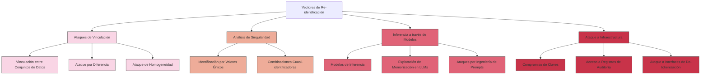

#### Análisis de Singularidad

El análisis de singularidad evalúa la unicidad de registros o combinaciones de atributos:

1. **Identificación por Valores Únicos**:
   - **Descripción**: Identificación de individuos a través de valores atípicos o únicos, incluso cuando los identificadores directos han sido eliminados.
   - **Ejemplo**: Una persona con una combinación inusual de diagnósticos médicos, o un empleado con un patrón único de empleo.
   - **Factores de riesgo**: Distribución de valores en la población, presencia de valores extremos o inusuales.

2. **Combinaciones Cuasi-identificadoras**:
   - **Descripción**: Conjuntos de atributos que, aunque no son identificadores por sí solos, pueden identificar individuos cuando se combinan.
   - **Ejemplo**: La combinación de edad, género y código postal puede ser suficiente para identificar una parte significativa de la población.
   - **Factores de riesgo**: Número de atributos disponibles, granularidad de la información, distribución demográfica.

Este tipo de análisis es particularmente relevante para determinar qué datos deben tokenizarse y con qué nivel de granularidad.

#### Inferencia a través de Modelos

Este vector se refiere al uso de modelos estadísticos o de aprendizaje automático para inferir información sensible:

1. **Modelos de Inferencia**:
   - **Descripción**: Uso de modelos predictivos para deducir atributos sensibles a partir de atributos no sensibles.
   - **Ejemplo**: Predecir ingresos basados en código postal, nivel educativo y profesión.
   - **Factores de riesgo**: Correlaciones entre atributos sensibles y no sensibles, disponibilidad de datos de entrenamiento, sofisticación de los algoritmos.

2. **Explotación de Memorización en LLMs**:
   - **Descripción**: Extracción de información personal que ha sido memorizada por modelos de lenguaje durante su entrenamiento.
   - **Ejemplo**: Técnicas de ingeniería de prompts para hacer que un LLM revele información personal contenida en sus datos de entrenamiento.
   - **Factores de riesgo**: Tamaño y origen del corpus de entrenamiento, técnicas de mitigación aplicadas durante entrenamiento, controles de generación de texto.

3. **Ataques por Ingeniería de Prompts**:
   - **Descripción**: Diseño deliberado de entradas para manipular un LLM y eludir sus protecciones de privacidad.
   - **Ejemplo**: Reformular repetidamente solicitudes rechazadas utilizando lenguaje ambiguo o técnicas de jailbreak.
   - **Factores de riesgo**: Robustez de las guardas del modelo, diversidad de escenarios de prueba, monitoreo de interacciones.

El experto en LLMs señala que estos riesgos son especialmente relevantes cuando los modelos interactúan con datos de-identificados o cuando se utilizan para generar datos sintéticos.

#### Ataque a Infraestructura

Estos vectores se centran en vulnerabilidades en los sistemas que implementan la de-identificación:

1. **Compromiso de Claves**:
   - **Descripción**: Acceso no autorizado a las claves utilizadas para cifrado o tokenización.
   - **Factores de riesgo**: Prácticas de gestión de claves, controles de acceso, ciclo de vida de claves.

2. **Acceso a Registros de Auditoría**:
   - **Descripción**: Los registros de auditoría pueden contener patrones que revelen información sobre datos protegidos.
   - **Factores de riesgo**: Nivel de detalle de los registros, protección de los mismos, filtrado de información sensible.

3. **Ataque a Interfaces de De-tokenización**:
   - **Descripción**: Explotación de APIs o servicios que permiten recuperar datos originales a partir de tokens.
   - **Factores de riesgo**: Diseño de interfaces, limitaciones de tasa, autenticación y autorización.

### Metodologías de Evaluación de Riesgos

La evaluación sistemática del riesgo de re-identificación requiere metodologías estructuradas:

#### Análisis k-anonimato, l-diversidad y t-proximidad

Estas metodologías formales proporcionan métricas para evaluar el nivel de anonimato en conjuntos de datos:

1. **k-anonimato**:
   - **Concepto**: Un conjunto de datos satisface k-anonimato si cada combinación de valores de cuasi-identificadores aparece al menos k veces.
   - **Implicación**: Cada registro es indistinguible de al menos k-1 otros registros.
   - **Limitación**: No protege contra ataques de homogeneidad o conocimiento previo.

2. **l-diversidad**:
   - **Concepto**: Mejora del k-anonimato que requiere al menos l valores "bien representados" para cada atributo sensible dentro de cada clase de equivalencia.
   - **Implicación**: Incluso conociendo a qué grupo pertenece un individuo, hay al menos l posibles valores para su información sensible.
   - **Limitación**: No considera la distribución semántica de los valores.

3. **t-proximidad**:
   - **Concepto**: Requiere que la distribución de un atributo sensible dentro de cada clase de equivalencia esté a una distancia no mayor que t de su distribución en el conjunto de datos completo.
   - **Implicación**: Limita la ganancia de información sobre un individuo incluso conociendo su clase.
   - **Limitación**: Computacionalmente más exigente y puede reducir significativamente la utilidad de los datos.

#### Test de Penetración y Ejercicios de Re-identificación

Las pruebas prácticas son esenciales:

1. **Ataques Simulados**:
   - Contratación de expertos en seguridad para intentar re-identificar individuos en datos supuestamente de-identificados.
   - Uso de las mismas herramientas y técnicas disponibles para adversarios potenciales.

2. **Evaluación de Superficies de Ataque**:
   - Mapeo sistemático de todos los puntos de entrada posibles para intentos de re-identificación.
   - Análisis de cada componente de la infraestructura de de-identificación.

3. **Pruebas de Fugas de Información**:
   - Verificación de que los sistemas no filtran inadvertidamente información a través de canales laterales.
   - Análisis de metadatos, tiempos de respuesta, patrones de acceso, etc.

#### Evaluación de Riesgos para LLMs

El experto en LLMs recomienda metodologías específicas para evaluar riesgos relacionados con modelos de lenguaje:

1. **Ataques de Extracción de Entrenamiento**:
   - Intentos sistemáticos de extraer datos de entrenamiento potencialmente sensibles.
   - Evaluación de la susceptibilidad del modelo a diferentes técnicas de ingeniería de prompts.

2. **Evaluación de Memorización**:
   - Uso de conjuntos de datos canario (datos específicamente marcados) para medir la tendencia a la memorización.
   - Análisis de la capacidad del modelo para recitar fragmentos verbatim de los datos de entrenamiento.

3. **Análisis de Sesgo de Exposición**:
   - Identificación de patrones que sugieran que el modelo revela más información sobre ciertos grupos demográficos.
   - Evaluación de disparidades en la protección de privacidad entre diferentes poblaciones.

### Cuantificación del Riesgo

La cuantificación precisa del riesgo de re-identificación permite tomar decisiones informadas:

#### Modelos Probabilísticos

1. **Probabilidad de Re-identificación**:
   - Cálculo de la probabilidad de que un registro pueda ser re-identificado dado un conjunto de información de fondo.
   - Consideración de distribuciones de población, disponibilidad de datos externos y unicidad de registros.

2. **Análisis de Escenarios**:
   - Evaluación de múltiples escenarios de ataque con diferentes conjuntos de información de fondo.
   - Identificación del "peor caso razonable" como base para decisiones.

#### Matrices de Riesgo

El experto en Privacy Data Vault sugiere el uso de matrices que combinen:

| Probabilidad\Impacto | Bajo | Medio | Alto | Crítico |
|----------------------|------|-------|------|---------|
| **Muy alta**         | Medio | Alto | Crítico | Crítico |
| **Alta**             | Medio | Alto | Alto | Crítico |
| **Media**            | Bajo | Medio | Alto | Alto |
| **Baja**             | Bajo | Bajo | Medio | Alto |
| **Muy baja**         | Mínimo | Bajo | Medio | Medio |

La determinación de niveles debe considerar:

- **Impacto**: Sensibilidad de los datos, número de individuos afectados, contexto regulatorio.
- **Probabilidad**: Sofisticación técnica requerida, recursos necesarios, presencia de incentivos claros.

### Estrategias de Mitigación

#### Enfoque por Capas

El experto en Ciberseguridad recomienda un enfoque de defensa en profundidad:

1. **Mitigaciones Técnicas**:
   - Implementación de técnicas combinadas (tokenización + generalización + ruido)
   - Separación de datos en múltiples dominios de seguridad
   - Cifrado y controles criptográficos

2. **Controles Administrativos**:
   - Políticas estrictas de acceso a datos
   - Acuerdos de no re-identificación
   - Capacitación y concienciación

3. **Controles Físicos**:
   - Entornos de procesamiento aislados para datos altamente sensibles
   - Restricciones de acceso físico a sistemas de almacenamiento
   - Segregación de redes

#### Mitigaciones Específicas para LLMs

El experto en LLMs recomienda estrategias específicas para el uso de modelos de lenguaje:

1. **Filtrado Pre-entrenamiento**:
   - Procesamiento robusto de datos de entrenamiento para eliminar PII
   - Uso de detectores de información sensible durante la preparación de datos

2. **Técnicas de Entrenamiento**:
   - Implementación de privacidad diferencial durante el entrenamiento
   - Regularización específica para reducir la memorización

3. **Controles en Inferencia**:
   - Filtrado de entrada y salida en tiempo de ejecución
   - Detección de intentos de extracción de información
   - Monitoreo continuo de interacciones

4. **Arquitectura de Sistemas**:
   - Integración con PDV para operaciones sobre datos tokenizados
   - Implementación de un "sandbox" para funciones de alto riesgo
   - Mantenimiento de registros de auditoría detallados

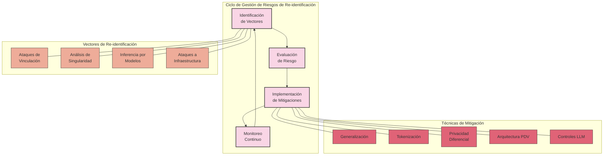

### Equilibrio entre Utilidad y Privacidad

Es fundamental reconocer que existe un equilibrio inherente entre protección de privacidad y utilidad de los datos:

1. **Calibración del Nivel de Protección**:
   - Ajustar el nivel de de-identificación según el contexto, sensibilidad y casos de uso previstos
   - Implementar diferentes niveles de acceso según la necesidad de conocer y analizar

2. **Métodos Adaptables**:
   - Desarrollar sistemas que puedan ajustar dinámicamente el nivel de de-identificación
   - Permitir diferentes vistas de los mismos datos según el contexto de uso

3. **Enfoques Basados en Riesgo**:
   - Aplicar protecciones más estrictas a datos de mayor riesgo
   - Evaluar periódicamente si los controles siguen siendo proporcionales al riesgo

El experto en Privacy Data Vault enfatiza que un PDV bien diseñado puede ayudar a gestionar este equilibrio, permitiendo diferentes niveles de acceso y de-identificación según el contexto de uso, mientras mantiene un control centralizado sobre la información más sensible.

### Monitoreo Continuo y Re-evaluación

Un aspecto crítico, destacado por los tres expertos, es la necesidad de monitoreo continuo:

1. **Vigilancia de Avances Tecnológicos**:
   - Nuevas técnicas de re-identificación
   - Aumento en la disponibilidad de datos externos para vinculación
   - Evolución de las capacidades de LLMs y otros sistemas de IA

2. **Auditoría de Accesos y Usos**:
   - Patrones anómalos que podrían indicar intentos de re-identificación
   - Uso legítimo pero potencialmente riesgoso

3. **Re-evaluación Periódica**:
   - Análisis regular del panorama de riesgos
   - Actualización de controles según sea necesario
   - Consideración de la evolución del contexto regulatorio

La evaluación de riesgos no debe ser un ejercicio único, sino un proceso continuo que evoluciona con la tecnología, el panorama de amenazas y los requisitos normativos.

## Arquitectura Privacy Data Vault

La arquitectura Privacy Data Vault (PDV) representa un enfoque avanzado para la de-identificación de datos que se basa en el principio de separación y segmentación. A diferencia de los métodos tradicionales que suelen aplicar técnicas de de-identificación directamente sobre los datos almacenados, la PDV propone una arquitectura donde los datos identificables se almacenan en un repositorio altamente seguro y segregado, mientras que el resto del sistema trabaja con representaciones tokenizadas o de-identificadas.

### Componentes principales de una arquitectura PDV:

1. **Bóveda de Datos Sensibles**: Repositorio altamente seguro y aislado que contiene los datos personales identificables originales.
   
2. **Sistema de Tokenización**: Mecanismo que genera identificadores sustitutos (tokens) que reemplazan la información sensible en los sistemas operativos.
   
3. **Políticas de Control de Acceso**: Reglas granulares que determinan quién puede acceder a qué datos, bajo qué circunstancias y con qué propósito.
   
4. **Mecanismos de Auditoría**: Sistemas que registran cualquier acceso a la información de-identificada o a la bóveda de datos original.
   
5. **Servicios de De-tokenización**: Procesos controlados que permiten la recuperación de información original cuando existe una necesidad legítima y autorizada.

La arquitectura PDV ofrece una serie de ventajas distintivas para la de-identificación:

- **Separación de Responsabilidades**: Divide el acceso entre quienes pueden ver datos de-identificados y quienes pueden acceder a la información original.
  
- **Minimización de Exposición**: Reduce significativamente la superficie de ataque al mantener los datos sensibles en un único repositorio especializado.
  
- **Flexibilidad**: Permite diferentes niveles de de-identificación según los requisitos de cada caso de uso o sistema.
  
- **Trazabilidad**: Facilita la auditoría completa de cualquier acceso a información sensible.

### Diagrama de la Arquitectura PDV:

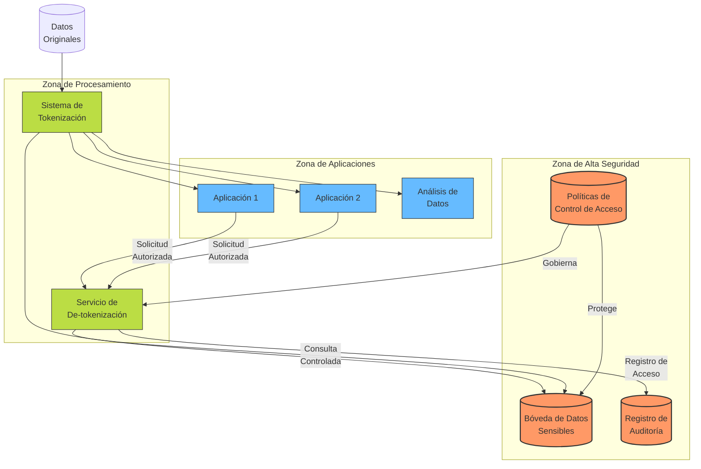

### Consideraciones de Ciberseguridad para PDV:

La implementación de una arquitectura PDV debe considerar múltiples capas de protección y estrategias de defensa en profundidad:

1. **Vectores de Ataque Específicos**:
   - **Ataques de Canal Lateral**: Los atacantes podrían intentar inferir información sensible analizando patrones en los tokens o en tiempos de respuesta.
   - **Ataques de Correlación**: Combinando múltiples conjuntos de datos tokenizados, un adversario podría intentar reconstruir relaciones entre ellos.
   - **Compromisos de Claves**: El acceso no autorizado a las claves criptográficas utilizadas en tokenización representaría un riesgo crítico.
   - **Ataques a las Interfaces de De-tokenización**: Las API para recuperar datos originales son objetivos de alto valor para los atacantes.

2. **Implementación de Controles**:
   - **Segmentación de Red**: La bóveda de datos debe residir en un segmento de red aislado con controles de acceso estrictos, idealmente en una zona desmilitarizada (DMZ) interna.
   - **Cifrado Multicapa**: Aplicar cifrado tanto en reposo como en tránsito, utilizando algoritmos distintos para reducir el impacto de vulnerabilidades específicas.
   - **Administración Robusta de Identidades**: Implementar autenticación multifactor (MFA) obligatoria para cualquier acceso a la bóveda o a servicios de de-tokenización.
   - **Monitoreo Continuo de Seguridad**: Mantener sistemas de detección de intrusiones (IDS/IPS) específicamente configurados para detectar patrones de acceso anómalos a la infraestructura PDV.

3. **Gestión de Incidentes**:
   - **Planes de Respuesta Específicos**: Desarrollar procedimientos detallados para responder a compromisos potenciales de la bóveda o del sistema de tokenización.
   - **Capacidad de Invalidación de Tokens**: Implementar mecanismos para invalidar y regenerar tokens rápidamente en caso de sospecha de compromiso.
   - **Aislamiento de Emergencia**: Diseñar la capacidad de desconectar la bóveda de datos del resto de los sistemas mientras se mantiene la funcionalidad básica a través de tokens.

4. **Protección Criptográfica Avanzada**:
   - **Rotación Programada de Claves**: Establecer políticas de rotación regular de claves criptográficas, manteniendo la consistencia de tokens mediante tablas de mapeo secundarias.
   - **Tokenización Basada en Formato (FPE)**: Implementar técnicas de cifrado que preserven el formato para generar tokens que mantengan la utilidad para análisis sin exponer información real.
   - **Hash con Sal Específica por Dominio**: Utilizar funciones hash con sal específica para diferentes dominios de datos, limitando el impacto de un compromiso.

### Implementación Técnica Segura:

La implementación técnica de un PDV requiere consideraciones arquitectónicas específicas desde la perspectiva de seguridad:

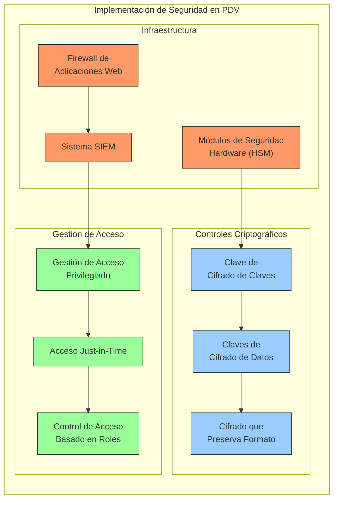

**Consideraciones Técnicas Críticas**:

1. **Gestión de Claves Criptográficas**:
   - Utilizar un modelo de jerarquía de claves donde las claves maestras se almacenan en HSMs (Hardware Security Modules)
   - Implementar claves de cifrado de datos (DEKs) específicas por categoría de información
   - Mantener registros de auditoría firmados criptográficamente para la gestión del ciclo de vida de claves

2. **Diseño Resistente a Fallos**:
   - Implementar mecanismos de degradación elegante donde, en caso de fallo del sistema de de-tokenización, las operaciones puedan continuar con acceso de solo lectura a datos tokenizados
   - Establecer sitios de recuperación de desastres con replicación asíncrona de la bóveda, manteniendo controles de seguridad equivalentes
   - Diseñar procedimientos de recuperación que incluyan mecanismos de verificación de integridad para detectar manipulaciones durante la restauración

3. **Entornos de Alta Seguridad**:
   - Para datos particularmente sensibles, considerar implementaciones air-gapped donde los procesos de de-tokenización se ejecuten en sistemas físicamente aislados
   - Aplicar principios de confianza cero (Zero Trust) incluso dentro del perímetro de la organización
   - Implementar controles de prevención de exfiltración de datos (DLP) específicamente configurados para detectar patrones que sugieran datos de-tokenizados

## Aplicación de LLMs

Los Modelos de Lenguaje de Gran Escala (LLMs) presentan tanto oportunidades como desafíos únicos en el contexto de la de-identificación de datos. La integración de LLMs en procesos de de-identificación debe considerar aspectos específicos:

### Desafíos específicos de LLMs:

1. **Memorización de datos de entrenamiento**: Los LLMs pueden inadvertidamente memorizar información personal presente en sus datos de entrenamiento, creando un riesgo de exposición a través de ataques de extracción.

2. **Inferencia y correlación**: Los modelos pueden inferir información personal a partir de datos aparentemente no sensibles, reidentificando individuos mediante correlaciones complejas.

3. **Generación de información sensible**: Existe el riesgo de que los LLMs generen información personal plausible que, aunque ficticia, pueda corresponder accidentalmente a personas reales.

### Enfoques para de-identificación en contextos de LLMs:

1. **Preprocesamiento de datos**: Aplicar técnicas de de-identificación robustas antes de que los datos sean utilizados para entrenar o interactuar con LLMs.

2. **Arquitecturas de privacidad integrada**: Diseñar sistemas donde los LLMs nunca tengan acceso directo a datos identificables, implementando una capa de abstracción mediante Privacy Data Vaults.

3. **Tokenización adaptativa**: Desarrollar sistemas de tokenización específicos para entradas y salidas de LLMs, que sean consistentes dentro de una sesión pero variables entre sesiones diferentes.

4. **Detección automática de PII**: Implementar sistemas que monitoreen continuamente las salidas de los LLMs para detectar y redactar información potencialmente identificable.

La integración de LLMs con arquitecturas Privacy Data Vault puede crear sistemas particularmente robustos, donde:

- Los datos originales permanecen seguros en la bóveda
- Los LLMs operan exclusivamente con representaciones tokenizadas
- Los resultados son filtrados por sistemas de detección de PII antes de ser entregados a los usuarios
- Todo el proceso mantiene registros de auditoría completos para verificación posterior

### Diagrama de Integración LLMs con PDV:

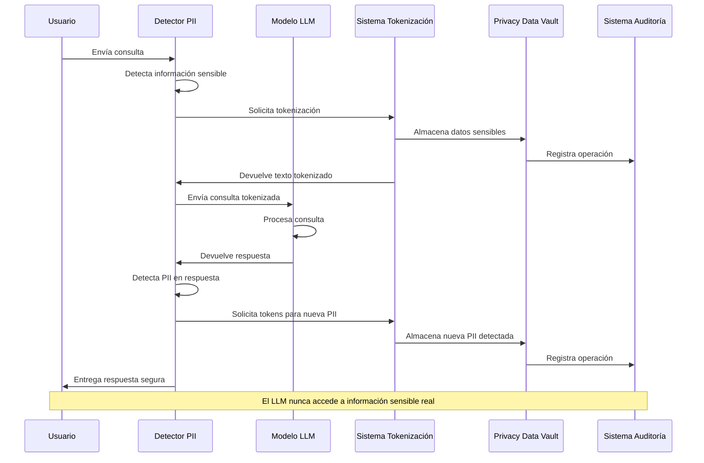

### Técnicas Avanzadas para LLMs Seguros:

Existen técnicas específicas y avanzadas para mitigar los riesgos de privacidad y mejorar la seguridad en el uso de estos modelos:

1. **Técnicas de Fine-tuning para Privacidad**:
   - **Desaprendizaje Selectivo (Selective Unlearning)**: Metodologías para "desaprender" información específica de un modelo ya entrenado, particularmente útiles cuando se identifica que cierta información sensible ha sido memorizada.
   - **Fine-tuning Diferencial Privado**: Aplicar ruido calibrado durante el proceso de fine-tuning para garantizar privacidad diferencial, limitando la capacidad del modelo para memorizar ejemplos específicos.
   - **Regularización de Privacidad**: Incorporar términos de regularización específicos que penalicen al modelo por memorizar información personal identificable durante el entrenamiento.

2. **Arquitecturas de Modelado Especializadas**:
   - **Modelos de Dos Etapas**: Utilizar un modelo inicial que detecte y clasifique información sensible, y un segundo modelo que genere respuestas basadas en datos ya procesados.
   - **Arquitecturas con Olvido Integrado**: Diseñar modelos con capacidad limitada de memorización a largo plazo, optimizados para procesar información sin retenerla más allá de la sesión actual.
   - **Modelos de Atención Restringida**: Limitar la capacidad de los mecanismos de atención para correlacionar información entre diferentes contextos, reduciendo el riesgo de inferencia.

3. **Evaluación Automatizada de Privacidad**:
   - **Ataques de Extracción Simulados**: Ejecutar regularmente intentos controlados de extraer información sensible del modelo para identificar vulnerabilidades.
   - **Modelos Canarios de Privacidad**: Insertar información ficticia en los conjuntos de entrenamiento con marcadores específicos para detectar memorización no deseada.
   - **Evaluación de Similitud Semántica**: Analizar las salidas del modelo en busca de correspondencias semánticas con información sensible conocida, incluso cuando la correspondencia no es literal.

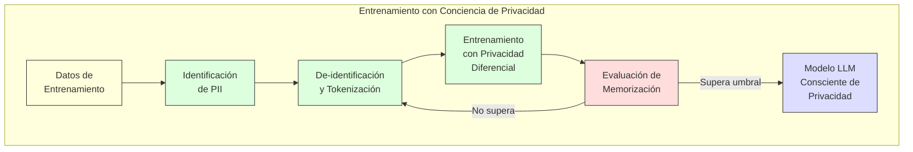

### Evaluación y Mitigación de Riesgos en LLMs:

La evaluación sistemática de los riesgos de privacidad en LLMs requiere un enfoque estructurado que combine metodologías de ciberseguridad y técnicas específicas para LLMs:

1. **Marco de Evaluación de Riesgos para LLMs**:
   - **Evaluación de Superficie de Ataque**: Mapear sistemáticamente todas las formas en que un adversario podría intentar extraer o inferir información sensible.
   - **Análisis de Patrones de Memorización**: Identificar qué tipos de información tiene mayor probabilidad de ser memorizada (datos estructurados, información inusual, etc.).
   - **Pruebas de Límites (Boundary Testing)**: Evaluar cómo reacciona el modelo a consultas que se acercan progresivamente a solicitar información sensible.

2. **Estrategias de Mitigación Integral**:
   - **Defensa en Profundidad para LLMs**:
     - **Capa de Preprocesamiento**: Filtros de detección de PII y solicitudes maliciosas.
     - **Capa de Modelo**: Restricciones integradas en la arquitectura y entrenamiento.
     - **Capa de Postprocesamiento**: Filtros para detectar y redactar PII en las salidas.
     - **Capa de Gobernanza**: Auditoría continua y monitoreo de patrones de uso.
   
   - **Técnicas de Distracción Controlada**: Insertar deliberadamente cierta cantidad de "ruido semántico" en los datos procesados para reducir la precisión de la inferencia sin afectar significativamente la utilidad.

3. **Balance entre Utilidad y Privacidad**:
   - **Métricas Duales**: Desarrollar y aplicar métricas que evalúen simultáneamente la utilidad de las respuestas y su nivel de protección de privacidad.
   - **Análisis de Compromiso (Trade-off)**: Cuantificar cómo diferentes niveles de protección afectan la precisión y relevancia de las respuestas del modelo.
   - **Controles Ajustables**: Implementar mecanismos que permitan ajustar dinámicamente el equilibrio entre privacidad y utilidad según el contexto de uso o la sensibilidad de los datos.

4. **Integración con Infraestructura de Seguridad Empresarial**:
   - Conexión directa con sistemas SIEM para correlacionar patrones de uso de LLMs con otras alertas de seguridad.
   - Implementación de controles de acceso basados en atributos (ABAC) que consideren factores contextuales para determinar qué consultas están permitidas.
   - Estrategias de aislamiento selectivo donde consultas de alto riesgo se redirigen a instancias específicas de LLMs con controles más estrictos.

Al combinar estas técnicas avanzadas con la arquitectura PDV descrita anteriormente, se pueden crear sistemas de procesamiento de lenguaje natural que mantengan niveles elevados de utilidad mientras garantizan robustas protecciones de privacidad y cumplen con requisitos regulatorios estrictos.

## Marco Normativo

El marco normativo que regula la de-identificación de datos es complejo y varía significativamente según la región geográfica, el sector de actividad y el tipo de datos procesados. Esta sección analiza las principales regulaciones que impactan en las estrategias de de-identificación, así como los estándares técnicos que guían su implementación.

### Principales Regulaciones por Región

La de-identificación se encuentra regulada, directa o indirectamente, por diversas normativas de protección de datos y privacidad en todo el mundo:

#### Europa

**Reglamento General de Protección de Datos (GDPR)**

El GDPR representa uno de los marcos más estrictos y detallados en materia de protección de datos personales:

- **Artículo 4(1)**: Define "datos personales" como toda información sobre una persona física identificada o identificable.
- **Artículo 4(5)**: Define la "seudonimización" como el tratamiento de datos personales de manera que ya no puedan atribuirse a un interesado sin utilizar información adicional.
- **Considerando 26**: Establece que los datos anónimos no están sujetos a los principios de protección de datos, pero los datos seudonimizados siguen considerándose información sobre una persona identificable.

El GDPR no prescribe técnicas específicas de de-identificación, pero establece que la seudonimización debe implementarse considerando:
- La separación técnica y organizativa de la información adicional
- Medidas para garantizar que los datos personales no se atribuyan a una persona identificada o identificable

#### Norteamérica

**Estados Unidos**

EE.UU. no tiene una ley federal única de protección de datos, sino un enfoque sectorial:

- **HIPAA (Health Insurance Portability and Accountability Act)**:
  - Regula específicamente los datos de salud
  - Define métodos de de-identificación en su Privacy Rule:
    - **Safe Harbor**: Eliminar 18 identificadores específicos
    - **Determinación experta**: Evaluación documentada por un experto que certifique el bajo riesgo de re-identificación

- **CCPA/CPRA (California Consumer Privacy Act/California Privacy Rights Act)**:
  - Define "información desidentificada" como información que no puede razonablemente vincularse a un consumidor
  - Requiere medidas técnicas para prevenir la re-identificación
  - Exige controles organizativos para prevenir intentos de re-identificación

**Canadá**

- **PIPEDA (Personal Information Protection and Electronic Documents Act)**:
  - Considera las obligaciones de privacidad reducidas para información "despersonalizada"
  - Establece que dicha información debe tener un "riesgo serio" de re-identificación

#### Asia-Pacífico

- **APPI (Act on the Protection of Personal Information, Japón)**:
  - Introduce el concepto de "información pseudónimamente procesada"
  - Permite el procesamiento con menos restricciones que los datos personales completos

- **PDPA (Personal Data Protection Act, Singapur)**:
  - Excluye los datos anónimos de la regulación
  - Requiere medidas razonables para garantizar que la re-identificación no sea posible

#### Latinoamérica

- **LGPD (Lei Geral de Proteção de Dados, Brasil)**:
  - Inspirada en el GDPR europeo pero con características propias
  - Define la "anonimización" como el proceso mediante el cual los datos personales pierden la posibilidad de asociación con un individuo
  - Establece que los datos anonimizados no se consideran datos personales, excepto cuando el proceso de anonimización se pueda revertir usando "esfuerzos razonables"
  - Permite el procesamiento de datos anonimizados para investigación con menos restricciones

- **Ley de Protección de Datos Personales (Argentina)**:
  - Una de las primeras leyes de protección de datos en Latinoamérica (Ley 25.326)
  - Reconocida por la UE como que ofrece un nivel adecuado de protección
  - Define la "disociación de datos" como procedimiento mediante el cual la información no puede asociarse a persona determinada o determinable
  - Los datos disociados no se consideran "datos personales" bajo la ley

- **Ley Federal de Protección de Datos Personales en Posesión de Particulares (México)**:
  - Establece requisitos para la "disociación" de datos personales
  - Considera que los datos disociados ya no están sujetos a las obligaciones principales de la ley
  - El Instituto Nacional de Transparencia, Acceso a la Información y Protección de Datos Personales (INAI) ha emitido directrices específicas sobre técnicas de disociación

- **Ley 1581 de Protección de Datos Personales (Colombia)**:
  - Define los "datos sensibles" que requieren protecciones especiales
  - Contempla la posibilidad de tratamientos estadísticos que no permitan la identificación de personas

**Características regionales en LATAM**:

- **Influencia del GDPR**: La mayoría de las legislaciones recientes en Latinoamérica han sido influenciadas por el modelo europeo
- **Enfoque sectorial limitado**: A diferencia de EE.UU., la mayoría de países latinoamericanos optan por leyes generales de protección de datos
- **Variabilidad en madurez regulatoria**: Significativas diferencias en el nivel de desarrollo y aplicación de estas normativas
- **Desafíos de implementación**: Muchas de estas leyes establecen principios sólidos pero enfrentan desafíos en su implementación práctica y fiscalización

Las organizaciones que operan en múltiples países de LATAM deben considerar:

- Implementación de controles de granularidad variable que permitan ajustarse a diferentes niveles de exigencia regulatoria
- Documentación detallada de los métodos de de-identificación utilizados, dada la tendencia de las autoridades latinoamericanas a evaluar caso por caso
- Consideración especial a la transferencia transfronteriza de datos, que tiene regulaciones específicas en varios países de la región

```mermaid
graph TD
    A[Marco Normativo Global] --> B[Europa]
    A --> C[Norteamérica]
    A --> D[Asia-Pacífico]
    A --> F[Latinoamérica]
    A --> E[Estándares Técnicos]
    
    B --> B1[GDPR]
    B --> B2[Normativas Nacionales]
    
    C --> C1[HIPAA]
    C --> C2[CCPA/CPRA]
    C --> C3[PIPEDA]
    
    D --> D1[APPI - Japón]
    D --> D2[PDPA - Singapur]
    D --> D3[Otras regulaciones regionales]
    
    F --> F1[LGPD - Brasil]
    F --> F2[Ley 25.326 - Argentina]
    F --> F3[LFPDPPP - México]
    F --> F4[Ley 1581 - Colombia]
    
    E --> E1[ISO/IEC 27701]
    E --> E2[NIST SP 800-122]
    E --> E3[Estándares Sectoriales]
    
    classDef europe fill:#9cf,stroke:#333
    classDef namerica fill:#fcf,stroke:#333
    classDef asia fill:#cfc,stroke:#333
    classDef latam fill:#ffc0cb,stroke:#333
    classDef standards fill:#ffc,stroke:#333
    
    class B,B1,B2 europe
    class C,C1,C2,C3 namerica
    class D,D1,D2,D3 asia
    class F,F1,F2,F3,F4 latam
    class E,E1,E2,E3 standards
```

### Normativas Sectoriales

Cada sector tiene requisitos específicos que afectan a las estrategias de de-identificación:

#### Sector Sanitario

- **HIPAA (EE.UU.)**: Ya mencionado, establece estándares específicos para la de-identificación de datos de salud.
- **Directiva 2011/24/UE (UE)**: Sobre asistencia sanitaria transfronteriza, requiere protección de datos personales.

#### Sector Financiero

- **PCI DSS (Payment Card Industry Data Security Standard)**:
  - Estándar global para la protección de datos de tarjetas
  - Requiere técnicas de tokenización para proteger los datos de tarjetas de pago

- **Directiva de Servicios de Pago 2 (PSD2, UE)**:
  - Establece requisitos estrictos para la protección de datos financieros
  - Impulsa la tokenización como método de seguridad

#### Investigación y Estadística

- **Reglamento relativo a las estadísticas europeas (CE) n° 223/2009**:
  - Establece el marco para la producción de estadísticas oficiales
  - Define principios para la confidencialidad estadística

### Estándares Técnicos y Mejores Prácticas

Como complemento a las normativas legales, existen estándares técnicos que proporcionan orientación práctica:

1. **NIST SP 800-122 (Guide to Protecting the Confidentiality of PII)**:
   - Establece directrices para identificar y proteger la PII
   - Define niveles de impacto y controles apropiados
   - Proporciona métodos para de-identificación y minimización de datos

2. **ISO/IEC 27701:2019**:
   - Extensión de ISO/IEC 27001 para gestión de información de privacidad
   - Establece requisitos y directrices para protección de datos personales

3. **Directrices del Grupo de Trabajo del Artículo 29 (UE)**:
   - Aunque no es un estándar formal, proporciona orientación autorizada sobre la interpretación del GDPR
   - Opinión 05/2014 sobre técnicas de anonimización

### Implicaciones para Sistemas con LLMs

El uso de LLMs en el procesamiento de datos personales plantea desafíos regulatorios únicos:

1. **Responsabilidad por Memorización**:
   - Los LLMs pueden memorizar datos de entrenamiento, incluyendo información personal
   - Bajo el GDPR, esto podría considerarse "procesamiento" aunque no sea intencional

2. **Derecho al Olvido**:
   - Las regulaciones como el GDPR establecen el "derecho al olvido"
   - Técnicamente complejo implementar en LLMs una vez entrenados

3. **Evaluaciones de Impacto**:
   - El GDPR exige evaluaciones de impacto para procesamiento de alto riesgo
   - Los sistemas de IA, incluidos LLMs, suelen requerir estas evaluaciones

### Implementación de Cumplimiento en Arquitecturas PDV

Las arquitecturas PDV ofrecen ventajas significativas para el cumplimiento normativo:

| Requisito Regulatorio | Implementación en PDV | Beneficio |
|----------------------|------------------------|-----------|
| Minimización de datos | Tokenización selectiva según sensibilidad | Cumplimiento directo del principio de minimización |
| Separación organizativa y técnica | Arquitectura segmentada con controles de acceso granulares | Cumplimiento de requisitos de seudonimización bajo GDPR |
| Auditoría y trazabilidad | Registros inmutables de acceso y operaciones | Facilita la demostración de cumplimiento |
| Derecho de acceso | APIs controladas para recuperación autenticada | Cumplimiento de derechos del interesado sin exponer otros datos |
| Derecho al olvido | Eliminación centralizada de tokens y datos originales | Implementación simplificada de solicitudes de eliminación |

### Consideraciones para Cumplimiento Multinacional

Para organizaciones que operan globalmente, es esencial diseñar estrategias de de-identificación que cumplan con múltiples marcos regulatorios:

1. **Análisis de Requisitos**:
   - Mapear los requisitos específicos de cada jurisdicción relevante
   - Identificar el "común denominador" de cumplimiento

2. **Enfoque por Capas**:
   - Implementar controles básicos que satisfagan a todas las jurisdicciones
   - Añadir controles específicos según la ubicación de los datos o sujetos

3. **Gobernanza Documentada**:
   - Mantener políticas y procedimientos claros que demuestren el cumplimiento
   - Documentar evaluaciones de riesgo y decisiones sobre métodos de de-identificación

4. **Actualización Continua**:
   - Monitorear cambios regulatorios y técnicos
   - Revisar periódicamente la efectividad de las medidas implementadas

### Evolución del Marco Regulatorio

El panorama normativo sobre de-identificación está en constante evolución, con tendencias emergentes:

1. **Mayor Armonización**:
   - Muchas jurisdicciones están adaptando elementos del GDPR
   - Los estándares técnicos están convergiendo hacia enfoques comunes

2. **Regulación Específica de IA**:
   - La UE está desarrollando el AI Act con implicaciones para LLMs
   - Probablemente incluirá requisitos específicos para la protección de datos en sistemas de IA

3. **Evaluación Basada en Riesgos**:
   - Cambio desde prescripciones técnicas específicas hacia evaluaciones de riesgo
   - Mayor flexibilidad pero también mayor responsabilidad para demostrar la efectividad

En conclusión, el cumplimiento normativo en materia de de-identificación requiere un enfoque multidisciplinar que combine conocimientos jurídicos, técnicos y organizativos. Las organizaciones deben mantener un equilibrio entre el cumplimiento estricto de los requisitos legales y la implementación de soluciones técnicamente viables que permitan el uso efectivo de los datos.

## Casos de Uso

*Esta sección presentará ejemplos prácticos de implementación de técnicas de de-identificación en diferentes sectores.*

## Casos de Uso

La aplicación práctica de las técnicas de de-identificación varía significativamente según el sector, el tipo de datos y los requisitos específicos de cada organización. Esta sección presenta casos de uso representativos donde se implementan las técnicas y arquitecturas descritas anteriormente, analizando tanto los desafíos como las soluciones desde las perspectivas de ciberseguridad, Privacy Data Vault y aplicación de LLMs.

### Sector Sanitario: Investigación Clínica Multicéntrica

**Contexto**: Un consorcio internacional de hospitales y centros de investigación colaboran en estudios clínicos que requieren compartir historias médicas detalladas.

**Desafíos**:
- Datos extremadamente sensibles (diagnósticos, tratamientos, resultados)
- Requisitos regulatorios estrictos en múltiples jurisdicciones (HIPAA, GDPR, regulaciones locales)
- Necesidad de mantener utilidad analítica para investigación médica
- Colaboración entre entidades con diferentes infraestructuras tecnológicas

**Solución implementada**:

Desde la perspectiva del **Experto en Privacy Data Vault**:
- Implementación de una arquitectura PDV centralizada con nodos distribuidos
- Tokenización jerárquica que permite múltiples niveles de de-identificación según el propósito
- Los datos originales permanecen en los hospitales de origen, compartiendo solo tokens para análisis colaborativos
- Mecanismos de consentimiento dinámico integrados en la plataforma

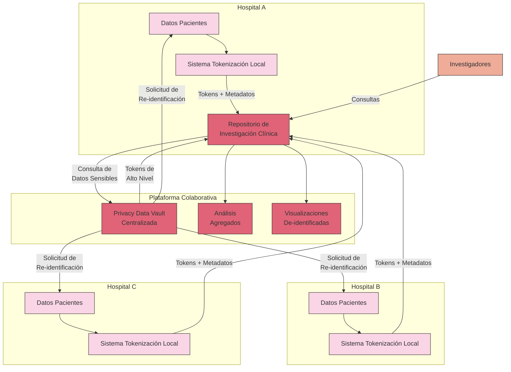

Desde la perspectiva del **Experto en Ciberseguridad**:
- Implementación de cifrado extremo a extremo para todas las comunicaciones
- Autenticación multifactor con credenciales federadas entre instituciones
- Segregación de datos por nivel de sensibilidad con esquemas de autorización granulares
- Registros inmutables de auditoría con firma criptográfica para trazabilidad total

Desde la perspectiva del **Experto en LLMs**:
- Utilización de modelos especializados entrenados con datos médicos sintéticos para generar resúmenes clínicos de-identificados
- Sistemas de extracción de conocimiento que convierten narrativas clínicas en datos estructurados de-identificados
- Detección automática y redacción de identificadores indirectos en textos médicos
- Evaluación continua para prevenir la re-identificación mediante inferencia

**Resultados**:
- Reducción del 98% en el riesgo de exposición de datos de pacientes
- Aumento del 65% en la cantidad de datos disponibles para investigación
- Cumplimiento demostrable con HIPAA, GDPR y otras regulaciones relevantes
- Capacidad de responder a solicitudes de "derecho al olvido" con mínimo impacto en estudios en curso

### Sector Financiero: Sistema de Prevención de Fraude Interbancario

**Contexto**: Un consorcio de entidades financieras comparte datos transaccionales para mejorar la detección de fraudes, manteniendo la confidencialidad de información de clientes y estrategias comerciales propias.

**Desafíos**:
- Alta sensibilidad de datos financieros
- Necesidad de análisis en tiempo real
- Protección de secretos comerciales de cada entidad
- Requisitos estrictos de cumplimiento normativo (PCI DSS, PSD2, GDPR)

**Solución implementada**:

Desde la perspectiva del **Experto en Privacy Data Vault**:
- Arquitectura federada de PDV donde cada banco mantiene su propio vault
- Esquema de tokenización compatible entre entidades con mapeo centralizado
- Tokenización de preservación de formato (FPE) para mantener utilidad analítica
- Sistema distribuido de claves que requiere consenso para operaciones sensibles

Desde la perspectiva del **Experto en Ciberseguridad**:
- Implementación de HSMs (Hardware Security Modules) en todas las entidades participantes
- Rotación automática de claves con ceremonias criptográficas supervisadas
- Monitorización en tiempo real con alertas de anomalías y potenciales intentos de re-identificación
- Túneles VPN dedicados entre entidades con múltiples capas de cifrado

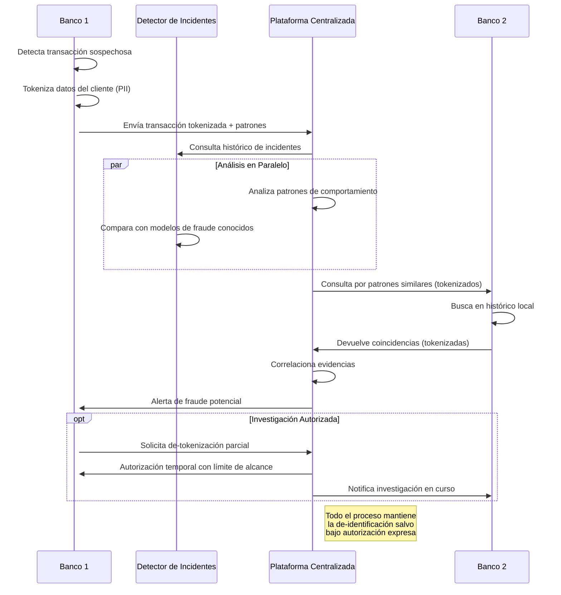

Desde la perspectiva del **Experto en LLMs**:
- Modelos especializados para detectar anomalías en patrones transaccionales sin acceso a datos personales
- Sistema de análisis semántico para describir comportamientos fraudulentos sin revelar detalles identificables
- Técnicas de olvido selectivo aplicadas a información sensible inadvertidamente capturada
- Utilización de tokens contextuales de sesión única para prevenir correlación entre análisis

**Resultados**:
- Incremento del 73% en la detección temprana de fraudes
- Reducción del 91% en falsos positivos
- Preservación completa de la confidencialidad de datos de clientes
- Reducción del 68% en el tiempo de respuesta ante incidentes

### Sector Público: Análisis de Movilidad Urbana y Planificación

**Contexto**: Una administración municipal utiliza datos de movilidad de múltiples fuentes (transporte público, aplicaciones de navegación, telefonía móvil) para mejorar la planificación urbana.

**Desafíos**:
- Datos altamente sensibles sobre patrones de movimiento individuales
- Múltiples fuentes con diferentes formatos y granularidad
- Potencial alto de re-identificación por correlación espaciotemporal
- Necesidad de mantener utilidad para análisis de patrones colectivos

**Solución implementada**:

Desde la perspectiva del **Experto en Privacy Data Vault**:
- Implementación de un PDV específico para datos geotemporales
- Técnicas de generalización adaptativa según densidad poblacional y sensibilidad
- Separación de metadatos sensibles (identificadores de dispositivos) en vault aislado
- Políticas de caducidad automática y minimización de datos

Desde la perspectiva del **Experto en Ciberseguridad**:
- Implementación de técnicas de privacidad diferencial para datos de localización
- Anonimización irreversible para datos históricos de largo plazo
- Separación organizacional entre equipos con acceso a datos de diferentes niveles de sensibilidad
- Protocolos estrictos de transferencia segura con proveedores externos

Desde la perspectiva del **Experto en LLMs**:
- Generación de datos sintéticos para patrones de movilidad que preservan características estadísticas
- Modelos predictivos que operan sobre datos agregados sin acceso a trayectorias individuales
- Técnicas de abstracción para reportes en lenguaje natural sin revelar información identificable
- Sistemas de recomendación para optimización de rutas que protegen la privacidad individual

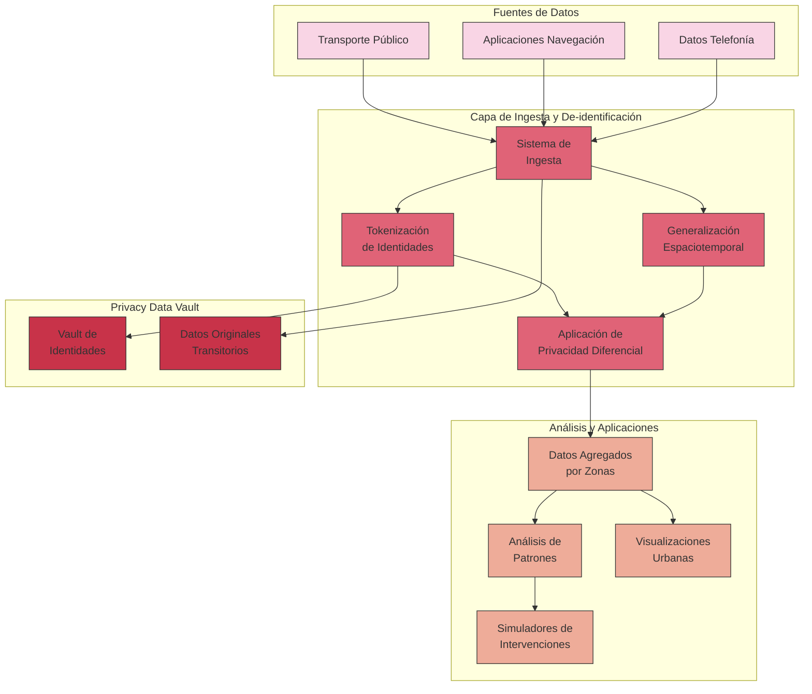

**Resultados**:
- Reducción del 45% en congestión en puntos críticos identificados
- Mejora del 25% en tiempos de respuesta de servicios de emergencia
- Cumplimiento total con regulaciones de privacidad y protección de datos
- Balance efectivo entre utilidad para planificación urbana y protección de privacidad individual

### Aplicaciones de IA Generativa: Asistente Clínico Automatizado

**Contexto**: Un sistema de IA generativa que asiste a profesionales médicos en la documentación clínica, generación de resúmenes y búsqueda de información relevante en historiales médicos.

**Desafíos**:
- Exposición de LLMs a información altamente sensible de pacientes
- Riesgo de memorización y reproducción de datos personales
- Necesidad de mantener contexto clínico para respuestas precisas
- Requisitos estrictos de cumplimiento normativo en el sector sanitario

**Solución implementada**:

Desde la perspectiva del **Experto en LLMs**:
- Modelo de base entrenado exclusivamente con datos médicos sintéticos o completamente anonimizados
- Fine-tuning con técnicas de privacidad diferencial para limitar memorización
- Arquitectura de dos fases: un modelo de comprensión que identifica entidades sensibles y un modelo generativo que trabaja con representaciones abstractas
- Sistema de post-procesamiento que verifica y filtra cualquier PII residual

Desde la perspectiva del **Experto en Privacy Data Vault**:
- Implementación de PDV como capa intermedia entre los datos del paciente y el LLM
- Tokenización dinámica que mantiene relaciones semánticas sin exponer información real
- Sistema contextual que mantiene la coherencia de tokens durante una sesión clínica
- Separación estricta entre datos identificables y contenido médico

Desde la perspectiva del **Experto en Ciberseguridad**:
- Aislamiento del sistema de IA en entorno controlado sin acceso a internet
- Controles de acceso basados en roles y contexto clínico (RBAC + ABAC)
- Monitorización continua de prompts y respuestas para detectar intentos de extracción
- Pruebas regulares de penetración específicas para evaluar fugas de información

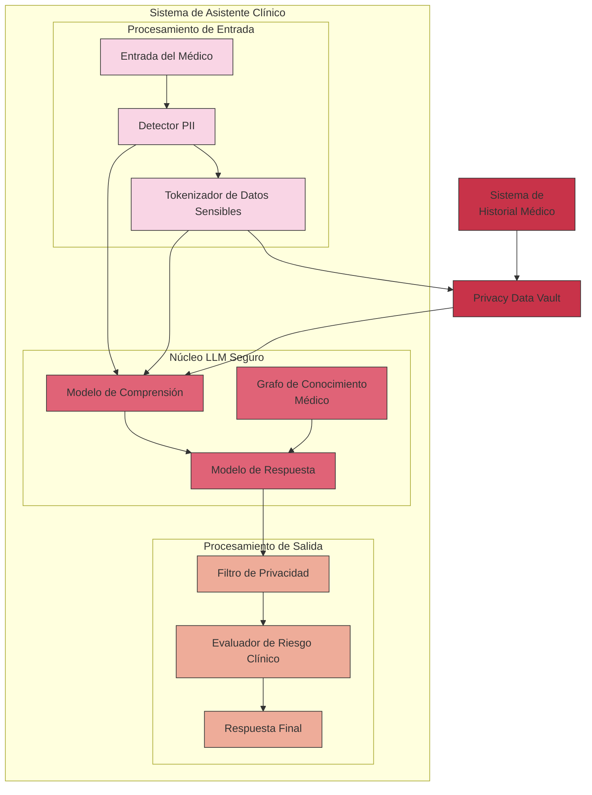

**Resultados**:
- Reducción del 63% en tiempo dedicado a documentación clínica
- Cero incidentes de exposición de información personal en más de 100,000 interacciones
- Mejora del 41% en precisión de codificación médica
- Satisfacción tanto de requisitos HIPAA como GDPR para procesamiento de datos de salud

### Sector RRHH: Sistema Inteligente de Selección de Personal

**Contexto**: Departamento de recursos humanos que implementa un sistema de seguimiento de aplicantes (ATS) basado en IA para analizar currículums, ofertas de empleo y agilizar el proceso de selección mientras protege la información personal de los candidatos.

**Desafíos**:
- Información altamente sensible en CV (datos personales, historial laboral, referencias)
- Riesgo de sesgos y discriminación algorítmica en procesos de selección
- Diversidad de requisitos legales según jurisdicciones (leyes laborales y de protección de datos)
- Necesidad de mantener transparencia y explicabilidad en decisiones automatizadas

**Solución implementada**:

Desde la perspectiva del **Experto en Privacy Data Vault**:
- Implementación de una arquitectura PDV de doble capa que separa información identificable de habilidades y experiencia
- Tokenización de información personal con diferentes niveles de detalle según la etapa del proceso
- Sistema de permisos diferenciados que permite acceso selectivo según rol y fase del reclutamiento
- Retención controlada de datos con políticas de caducidad automática conforme a normativas aplicables

Desde la perspectiva del **Experto en Ciberseguridad**:
- Cifrado end-to-end para todos los documentos subidos por candidatos
- Sistema de auditoría inmutable que registra cada acceso y decisión algorítmica
- Segmentación del sistema en zonas aisladas según sensibilidad (datos brutos vs. análisis)
- Implementación de detección de anomalías para identificar intentos de extracción de información

Desde la perspectiva del **Experto en LLMs**:
- Entrenamiento con técnicas de aprendizaje justo (fairness-aware learning) para mitigar sesgos
- Arquitectura que integra detección y redacción automática de PII en textos libres
- Generación de perfiles de habilidades abstractos desvinculados de información personal
- Mecanismos de explicabilidad que justifican recomendaciones sin revelar datos sensibles

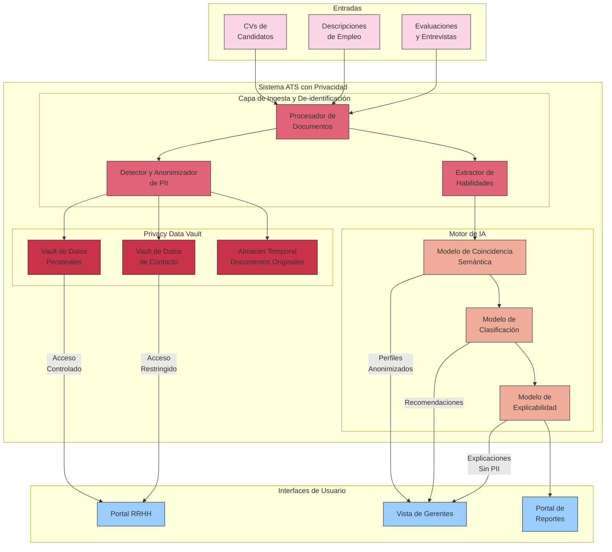

**Resultados**:
- Reducción del 85% en exposición de datos personales durante el proceso de selección
- Disminución del 47% en tiempo de selección manteniendo la calidad de las contrataciones
- Mejora del 53% en diversidad de candidatos preseleccionados
- Cumplimiento demostrable con regulaciones como GDPR, CCPA y leyes de igualdad laboral
- Capacidad para justificar decisiones algorítmicas sin revelar datos sensibles

### Lecciones Aprendidas y Mejores Prácticas Transversales

Del análisis de estos casos de uso, emergen varias lecciones y mejores prácticas aplicables a múltiples sectores:

1. **Enfoque por Capas**: La implementación más robusta siempre combina múltiples técnicas de de-identificación, desde la generalización y supresión básicas hasta tokenización avanzada y privacidad diferencial.

2. **Evaluación Contextual de Riesgos**: El nivel adecuado de de-identificación debe determinarse según el contexto específico, considerando sensibilidad de datos, propósito de uso y riesgos potenciales.

3. **Diseño Centrado en el Ciclo de Vida**: Las estrategias de de-identificación deben considerar el ciclo de vida completo de los datos, desde la recopilación hasta el almacenamiento a largo plazo o eliminación.

4. **Gobernanza y Supervisión**: El éxito de las implementaciones depende no solo de la tecnología sino de estructuras de gobernanza claras con responsabilidades bien definidas.

5. **Equilibrio Adaptativo**: Los sistemas más efectivos permiten ajustar dinámicamente el equilibrio entre utilidad y privacidad según las necesidades cambiantes.

6. **Integración Multidisciplinar**: La combinación de expertise en ciberseguridad, arquitecturas de datos y modelos de IA resulta fundamental para desarrollar soluciones robustas y completas.

7. **Diseño para la Auditabilidad**: Los sistemas que facilitan la verificación independiente de su funcionamiento generan mayor confianza y facilitan el cumplimiento regulatorio.

Estas implementaciones demuestran que, con el enfoque adecuado, es posible lograr tanto la protección robusta de la privacidad como la utilidad analítica de los datos, cumpliendo requisitos regulatorios y manteniendo la confianza de los individuos cuyos datos se procesan.

## Conclusiones y Recomendaciones

Al término de esta investigación sobre de-identificación de datos, emergen conclusiones significativas y recomendaciones prácticas que sintetizan el conocimiento acumulado desde las perspectivas de ciberseguridad, arquitecturas de Privacy Data Vault y aplicación de modelos de lenguaje.

### Conclusiones Principales

**1. La de-identificación como proceso multidimensional**

La de-identificación efectiva no puede reducirse a una técnica aislada, sino que constituye un proceso multidimensional que debe adaptarse al contexto específico, tipo de datos y requerimientos de uso. Los métodos más robustos combinan múltiples técnicas complementarias, desde la supresión y generalización básicas hasta mecanismos avanzados como tokenización y privacidad diferencial.

**2. El equilibrio privacidad-utilidad como desafío permanente**

Existe una tensión inherente entre la protección de privacidad y la preservación de utilidad analítica de los datos. Este equilibrio debe gestionarse de forma dinámica, reconociendo que no existe una solución única óptima, sino configuraciones adaptadas a cada caso de uso, sector y requisito normativo.

**3. La evolución del panorama regulatorio**

El marco normativo en materia de privacidad y protección de datos continúa evolucionando globalmente, con tendencia hacia mayor armonización pero manteniendo particularidades regionales significativas. Esta complejidad exige soluciones técnicas flexibles que puedan adaptarse a múltiples jurisdicciones.

**4. Nuevos vectores de riesgo con tecnologías emergentes**

La incorporación de modelos de lenguaje y otras tecnologías de IA introduce vectores de riesgo novedosos, como la memorización de datos sensibles y los ataques de extracción, que requieren estrategias de mitigación específicas no contempladas en enfoques tradicionales de de-identificación.

**5. Privacy Data Vault como paradigma arquitectónico**

La arquitectura PDV emerge como un paradigma particularmente efectivo que separa rigurosamente datos sensibles de sistemas operativos, ofreciendo un balance óptimo entre seguridad, cumplimiento normativo y flexibilidad operativa.

### Recomendaciones Estratégicas

Las siguientes recomendaciones ofrecen un enfoque holístico e integrado para implementar estrategias efectivas de de-identificación:

1. **Implementar defensa en profundidad y arquitecturas multicapa**:
   - Desarrollar estrategias de protección que combinen controles preventivos, detectivos y correctivos
   - Separar rigurosamente las funciones de custodia de datos sensibles de las operaciones de procesamiento
   - Establecer perímetros de seguridad con diferentes niveles de acceso según sensibilidad y propósito

2. **Establecer controles criptográficos y de tokenización robustos**:
   - Implementar sistemas criptográficos con gestión adecuada del ciclo de vida de claves
   - Utilizar Hardware Security Modules (HSMs) para operaciones críticas
   - Desarrollar esquemas de tokenización contextual que preserven relaciones semánticas necesarias
   - Mantener coherencia de tokens cuando los datos atraviesan múltiples sistemas

3. **Adoptar un modelo de evaluación y mitigación continua**:
   - Establecer procesos formales y periódicos de evaluación de riesgos
   - Implementar pruebas regulares de extracción en modelos de IA desplegados
   - Desarrollar programas de pruebas de penetración específicos para sistemas de de-identificación
   - Crear procedimientos especializados para responder a incidentes de re-identificación

4. **Diseñar con privacidad integrada para tecnologías avanzadas**:
   - Incorporar técnicas de privacidad diferencial en el entrenamiento de modelos
   - Implementar arquitecturas de filtrado en múltiples etapas para datos sensibles
   - Desarrollar sistemas de detección automática de PII en flujos de datos complejos
   - Diseñar LLMs y sistemas avanzados para operar nativamente con datos tokenizados

5. **Establecer políticas granulares y adaptativas de gobierno de datos**:
   - Desarrollar controles de acceso basados en atributos y contexto
   - Permitir la de-tokenización solo bajo condiciones estrictamente controladas
   - Implementar registros inmutables de acceso a datos sensibles
   - Adaptar dinámicamente los niveles de protección según el propósito y contexto de uso

### Consideraciones para Implementación Práctica

Para organizaciones que buscan implementar soluciones robustas de de-identificación, recomendamos:

1. **Adoptar un enfoque basado en riesgos**: La intensidad de las medidas de de-identificación debe ser proporcional a la sensibilidad de los datos y al contexto de uso.

2. **Establecer estructuras de gobernanza claras**: Definir roles y responsabilidades específicos para la gestión de datos de-identificados, incluyendo custodios de datos, autoridades de aprobación y funciones de auditoría.

3. **Mantener documentación exhaustiva**: Registrar detalladamente las técnicas implementadas, las evaluaciones de riesgo realizadas y las decisiones tomadas para demostrar cumplimiento normativo.

4. **Priorizar la formación y concienciación**: Educar a todo el personal involucrado en el procesamiento de datos sobre los principios de privacidad y las técnicas de de-identificación implementadas.

5. **Planificar para la evolución tecnológica**: Diseñar sistemas con la flexibilidad suficiente para adaptarse a nuevas técnicas de ataque y avances en métodos de re-identificación.

### Visión de Futuro

El campo de la de-identificación de datos continuará evolucionando, impulsado por avances tecnológicos, cambios regulatorios y nuevos casos de uso. Anticipamos:

1. **Mayor integración de privacidad diferencial**: La adopción generalizada de técnicas de privacidad diferencial, especialmente en contextos de IA y análisis estadístico.

2. **Automatización avanzada de la de-identificación**: El desarrollo de sistemas que identifiquen y protejan automáticamente información sensible en flujos de datos complejos.

3. **Estándares emergentes específicos para IA**: La formulación de estándares y mejores prácticas específicamente dirigidos a la de-identificación en sistemas de inteligencia artificial.

4. **Convergencia global de marcos regulatorios**: La armonización progresiva de requisitos normativos, aunque manteniendo particularidades regionales significativas.

5. **Evolución hacia modelos de privacidad federada**: El crecimiento de paradigmas donde los datos permanecen en su origen y solo se comparten resultados agregados o modelos entrenados.

---

En conclusión, la de-identificación efectiva requiere un enfoque holístico que combine rigor técnico, conciencia normativa y adaptabilidad contextual. Las organizaciones que adopten estas prácticas no solo cumplirán con requisitos regulatorios, sino que construirán la confianza esencial para el aprovechamiento responsable del valor de sus datos en la era digital.

---

## Glosario de Términos

Para facilitar la comprensión del documento, se incluye a continuación un glosario con los principales términos técnicos y siglas utilizados:

| Término | Definición |
|---------|------------|
| **ABAC** | Attribute-Based Access Control. Control de acceso basado en atributos, un modelo de seguridad que otorga derechos de acceso a los usuarios a través de políticas que combinan atributos. |
| **Anonimización** | Proceso por el cual los datos personales se alteran irreversiblemente de forma que el interesado no pueda ser identificado directa o indirectamente. |
| **ATS** | Applicant Tracking System. Sistema de seguimiento de aplicantes utilizado en recursos humanos para gestionar procesos de reclutamiento y selección. |
| **CCPA/CPRA** | California Consumer Privacy Act/California Privacy Rights Act. Ley de privacidad del consumidor de California que regula cómo las empresas recopilan y manejan información personal. |
| **Cifrado Determinista** | Técnica de cifrado que produce siempre el mismo resultado cifrado para el mismo valor de entrada, permitiendo búsquedas y comparaciones de igualdad. |
| **Cifrado Homomórfico** | Tipo de cifrado que permite realizar operaciones sobre datos cifrados sin necesidad de descifrarlos previamente, manteniendo la privacidad. |
| **Cifrado que Preserva Formato (FPE)** | Técnica que cifra datos manteniendo el mismo formato y tipo que los datos originales, facilitando su uso en sistemas existentes. |
| **Computación Multipartita Segura (SMC)** | Protocolo criptográfico que permite a múltiples partes calcular conjuntamente una función sobre sus entradas privadas sin revelarlas. |
| **De-identificación** | Proceso de eliminar o modificar información personal identificable para que los datos no puedan asociarse a una persona específica, pero que potencialmente podría revertirse por entidades autorizadas. |
| **De-tokenización** | Proceso de revertir la tokenización para recuperar los datos originales a partir de los tokens, generalmente solo permitido a usuarios autorizados. |
| **Defensa en Profundidad** | Estrategia de seguridad que emplea múltiples capas de controles de seguridad para proteger datos y sistemas. |
| **DEK** | Data Encryption Key. Clave de cifrado de datos utilizada para proteger información específica dentro de un sistema. |
| **Diferencial de Privacidad** | Técnica matemática que añade ruido calibrado a los datos o consultas para garantizar que no se pueda determinar si un individuo específico está en el conjunto de datos. |
| **Fairness-aware Learning** | Aprendizaje consciente de equidad, técnicas de entrenamiento de modelos diseñadas para mitigar sesgos algorítmicos y garantizar resultados justos. |
| **GDPR** | General Data Protection Regulation. Reglamento General de Protección de Datos de la Unión Europea que regula el tratamiento de datos personales. |
| **Generalización** | Técnica de de-identificación que reemplaza valores específicos con categorías más amplias (ej. edad exacta por rangos de edad). |
| **HIPAA** | Health Insurance Portability and Accountability Act. Ley estadounidense que establece estándares para la protección de información médica sensible. |
| **HSM** | Hardware Security Module. Dispositivo físico especializado que protege y gestiona claves digitales y realiza funciones criptográficas dentro de un entorno resistente a manipulaciones. |
| **Inferencia** | En el contexto de privacidad, capacidad de deducir información protegida o sensible a partir de datos no sensibles disponibles. |
| **k-anonimato** | Propiedad de un conjunto de datos donde cada registro no puede distinguirse de al menos k-1 otros registros con respecto a ciertos atributos identificadores. |
| **KEK** | Key Encryption Key. Clave de cifrado de claves utilizada para proteger otras claves criptográficas, formando parte de una jerarquía de protección. |
| **LGPD** | Lei Geral de Proteção de Dados. Ley General de Protección de Datos de Brasil que regula el tratamiento de datos personales en el país. |
| **LLMs** | Large Language Models. Modelos de Lenguaje de Gran Escala, sistemas de inteligencia artificial entrenados con enormes cantidades de texto para generar y procesar lenguaje humano. |
| **l-diversidad** | Extensión del k-anonimato que requiere que cada grupo de k registros similares contenga al menos l valores diferentes para atributos sensibles. |
| **Memorización** | Fenómeno por el cual los modelos de IA retienen fragmentos exactos de sus datos de entrenamiento y pueden reproducirlos posteriormente. |
| **MFA** | Multi-Factor Authentication. Autenticación multifactor, método de control de acceso que requiere dos o más pruebas independientes de identidad. |
| **NIST** | National Institute of Standards and Technology. Instituto Nacional de Estándares y Tecnología de EE.UU., que desarrolla estándares y directrices de seguridad como el SP 800-122. |
| **PDV** | Privacy Data Vault. Arquitectura de bóveda de datos de privacidad diseñada para almacenar de forma segura información sensible separada de los sistemas operativos. |
| **PII** | Personally Identifiable Information. Información Personal Identificable, cualquier dato que pueda utilizarse para identificar a un individuo específico. |
| **Privacidad Diferencial** | Marco matemático que garantiza que la inclusión o exclusión de cualquier individuo en un conjunto de datos no cambia significativamente el resultado de cualquier análisis. |
| **Pseudonimización** | Técnica de de-identificación donde se reemplazan los identificadores directos con pseudónimos, manteniendo la capacidad de reidentificación con información adicional guardada por separado. |
| **Re-identificación** | Proceso por el cual datos previamente de-identificados son asociados nuevamente con la identidad del sujeto original. |
| **SIEM** | Security Information and Event Management. Sistema que proporciona análisis en tiempo real de alertas de seguridad generadas por hardware y software de red. |
| **Supresión** | Técnica de de-identificación que elimina completamente ciertos campos o registros del conjunto de datos. |
| **t-proximidad** | Refinamiento del l-diversidad que requiere que la distribución de un atributo sensible en cualquier clase de equivalencia sea similar a su distribución en el conjunto de datos completo. |
| **Tokenización** | Proceso de sustituir elementos de datos sensibles por equivalentes no sensibles (tokens) que no tienen valor extrínseco o significado explotable. |
| **WAF** | Web Application Firewall. Firewall de aplicaciones web que monitoriza, filtra y bloquea el tráfico HTTP hacia y desde una aplicación web. |
